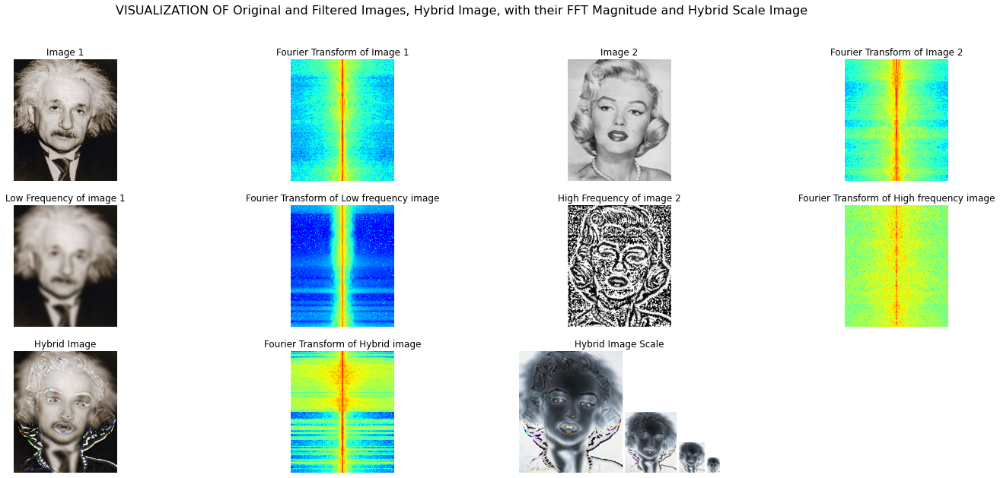
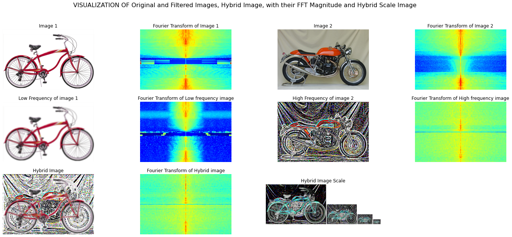

# Hybrid-Images
A hybrid image is an image that is perceived in one of two different ways, depending on viewing distance, based on the way humans process visual input. 

## Overview

A hybrid image is the sum of a *low-pass filtered* version of the one image and a *high-pass filtered* version of a second image. There is a free parameter, which can be tuned for each image pair, which controls how much high frequency to remove from the first image and how much low frequency to leave in the second image. This is called the “cutoff-frequency”. In the paper it is suggested to use two cutoff frequencies (one tuned for each image) and you are free to try that, as well. In the starter code, the cutoff frequency is controlled by changing the standard deviation of the Gausian filter used in constructing the hybrid images. [This](https://drive.google.com/uc?id=187FjBJLwnYXhylx08Vdh1SAA3AO-imYv) is the sample example.

We provided 7 pairs of aligned images. The alignment is important because it affects the perceptual grouping (read the paper for details). You can create additional examples (e.g. change of expression, morph between different objects, change over time, etc.).

# Results

